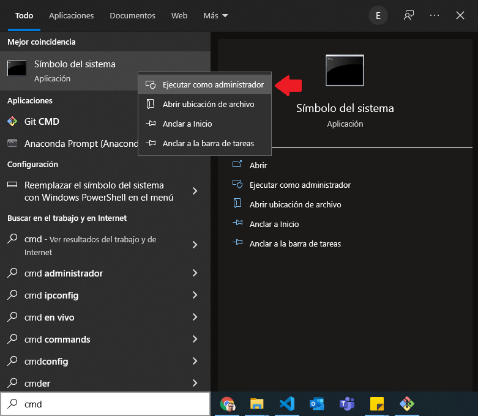
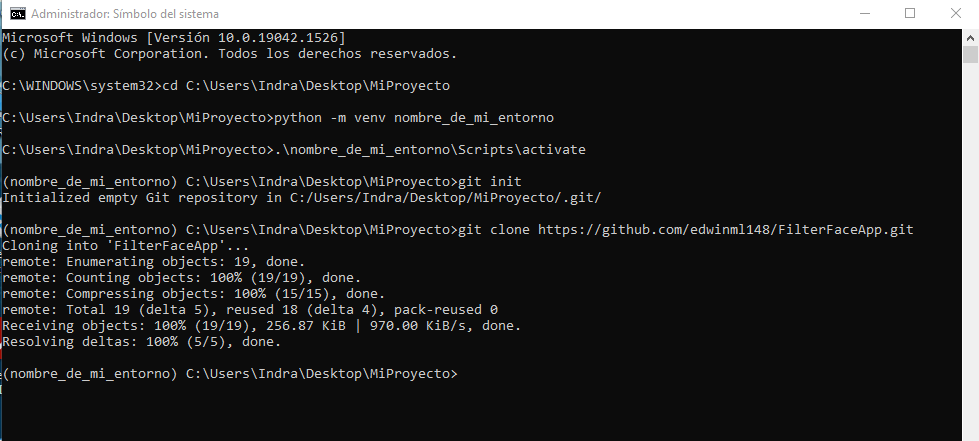
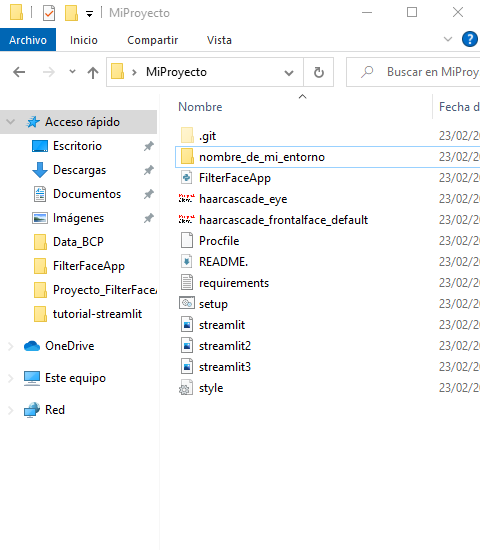
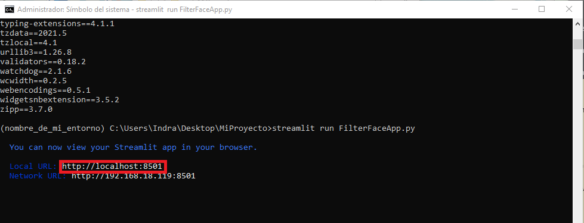
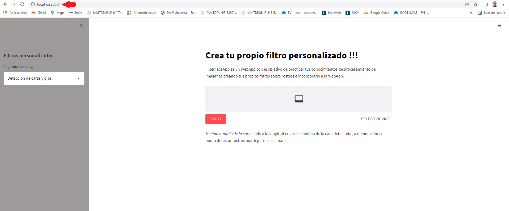

# FilterFaceApp

## Índice

* [1. Motivacion](#1-Motivacion)
* [2. Uso en entorno local](#2-Instalacion)
* [3. Filtros perzonalizados](#3-Filtros-perzonalizados)
* [4. Creacion de filtros](#4-creacion-de-filtros)
* [5. Deploy Heroku](#5-Deploy-Heroku)


***

## 1. Motivacion


FilterFaceApp es una WebApp de vision artificial en tiempo real desarrollada en [ Streamlit ](https://streamlit.io/) y montada en [Heroku](https://dashboard.heroku.com/apps) con el objetivo crear tus propios filtros personalizados, estos pueden ser aplicados directamente a todo el video o espeficiamente a caras detectadas.

Streamlit es un excelente framework para científicos de datos, investigadores y desarrolladores de aprendizaje automático, y streamlit-webrtc lo amplía para poder manejar transmisiones de video (y audio) en tiempo real.

Puedes probarlo aqui : https://filterfaceapp.herokuapp.com/


## 2. Uso en entorno local

Para el uso en entorno local de FilterFaceApp se requiere tener instalado una version de igual o superior a Python 3.8 , se recomienda tener instalado el IDE **Visual Studio Code** y **git** . Se requiere instalar las siguientes librerias.

* streamlit == 1.5.1
* numpy == 1.22.2
* streamlit-webrtc == 0.35.0
* opencv-contrib-python-headless == 4.5.5.62
* av == 8.1.0

Se recomienda el uso de un entorno virtual usando virtualenv o anaconda. En este proyecto usamos virtualenv y detallaremos como realizarlo.

1. Abrir cmd con permisos de administrador.



2. Ingresa a la ruta donde estara el proyecto.


3. Añadir los siguientes comandos :
 
    * ```python -m venv nombre_de_mi_entorno```
    * ```.\nombre_de_mi_entorno\Scripts\activate```
    * ```git init```
    * ```git clone https://github.com/edwinml148/FilterFaceApp.git```



4. Mover los archivos de la carpeta clonada al directorio principal del proyecto.



5. Instalar las librerias con el comando ```pip install -r requirements.txt```


6. Ahora si podemos usar nuestra WebApp en entorno local con el comando ```streamlit run FilterFaceApp.py``` , se abrira una ventana en el navegador con el localhost.





## 4. Creacion de filtros

FilterFaceApp detecta rostros en video-stream en tiempo real basado en un algortimo de rapida deteccion de objetos usando *Boostend Cascade Of Simple Feature*. dicho algortimo introduce el concepto de *imagen integral* es cual hace que se mas rapido que propuestas anteriores. Podras encontrar mayor informacion en el siguiente paper https://www.cs.cmu.edu/~efros/courses/LBMV07/Papers/viola-cvpr-01.pdf


FilterFaceApp detecta rostros en video-stream en tiempo real usando dos algortimos, clasificador pre-entrenado de Haar Cascades y la deteccion de objetos a multiples escalas ( detectMultiScale ).

EL clasificador Haar Cascades es un enfoque de machine learning para la deteccion visual de objetos que es capaz de procesar imagenes extramadamente rapido , gracias que combina los conceptos de imagenes integral y un algortimo de aprendizaje de AdaBoost.

DetectMultiScale, 

[](https://www.youtube.com/watch?v=--b-9HrKK6w)

### HTML y CSS

* [ ] [Uso de HTML semántico.](https://developer.mozilla.org/en-US/docs/Glossary/Semantics#Semantics_in_HTML)
* [ ] Uso de selectores de CSS.
* [ ] Construir tu aplicación respetando el diseño realizado (maquetación).

### DOM

* [ ] Uso de selectores del DOM.
* [ ] Manejo de eventos del DOM.
* [ ] [Manipulación dinámica del DOM.](https://developer.mozilla.org/es/docs/Referencia_DOM_de_Gecko/Introducci%C3%B3n)
(appendChild |createElement | createTextNode| innerHTML | textContent | etc.)

### JavaScript

* [ ] Manipulación de strings.
* [ ] Uso de condicionales (if-else | switch | operador ternario)
* [ ] Uso de bucles (for | for..in | for..of | while)
* [ ] Uso de funciones (parámetros | argumentos | valor de retorno)
* [ ] Declaración correcta de variables (const & let)

### Testing

* [ ] [Testeo unitario.](https://jestjs.io/docs/es-ES/getting-started)

### Estructura del código y guía de estilo

* [ ] Organizar y dividir el código en módulos (Modularización)
* [ ] Uso de identificadores descriptivos (Nomenclatura | Semántica)
* [ ] Uso de linter (ESLINT)

### Git y GitHub

* [ ] Uso de comandos de git (add | commit | pull | status | push)
* [ ] Manejo de repositorios de GitHub (clone | fork | gh-pages)

### UX

* [ ] Diseñar la aplicación pensando y entendiendo al usuario.
* [ ] Crear prototipos para obtener feedback e iterar.
* [ ] Aplicar los principios de diseño visual (contraste, alineación, jerarquía)

## 4. Consideraciones generales

* El equipo de coaches te dará un tiempo sugerido e indicaciones sobre si trabajar
  sola o en equipo. Recuerda que cada una aprende a diferente ritmo.
* El proyecto será entregado subiendo tu código a GitHub (commit/push) y la
  interfaz será desplegada usando GitHub pages. Si no sabes lo que es GitHub, no
  te preocupes, lo aprenderás durante este proyecto.

## 5. Criterios de aceptación mínimos del proyecto

Usa solo caracteres numéricos (dígitos) en la tarjeta a validar [0-9].

### Definición del producto

En el `README.md`, cuéntanos cómo pensaste en los usuarios y cuál fue tu proceso
para definir el producto final a nivel de experiencia y de interfaz.

* Quiénes son los principales usuarios de producto.
* Cuáles son los objetivos de estos usuarios en relación con tu producto.
* Cómo crees que el producto que estás creando está resolviendo sus problemas.

### Interfaz de usuario (UI)

La interfaz debe permitir al usuario:

* Insertar el número que queremos validar.
* Ver el resultado si es válido o no.
* Ocultar todos los dígitos de su número de tarjeta menos los últimos
4 caracteres.
* No debe poder ingresar un campo vacío.

### UX (Diseño de experiencia de usuario)

Antes de iniciar a codear, debes entender el problema que quieres solucionar y
cómo tu aplicación lo soluciona.

* Trabaja tu primer prototipo con papel y lápiz (blanco y negro).
* Luego valida esta solución con una compañera (pedir feedback).
* Toma lo aprendido al momento de validar tu primer prototipo y desarrolla un
  nuevo prototipo usando alguna herramienta para diseño de prototipos
  ([Balsamiq](https://balsamiq.com/), [Figma](https://www.figma.com/),
  [Google Slides](https://www.google.com/intl/es/slides/about/), etc.)
Estos puntos los presentarás en el `README.md`.

### Scripts / Archivos

#### General

##### `README.md`

Debe contener lo siguiente:

* Un título con el nombre de tu proyecto.
* Explicar cómo descargar, instalar y ejecutar la aplicación
  así como una introducción.
* Un resumen de 1 o 2 líneas de qué se trata tu proyecto.
* La imagen final de tu proyecto.
* Investigación UX:
  1. Explicar quiénes son los usuarios y los objetivos en relación con el
    producto.
  2. Explicar cómo el producto soluciona los problemas/necesidades de dichos
    usuarios.
  3. Luego colocarás la foto de tu primer prototipo en papel.
  4. Agregar un resumen del feedback recibido indicando las mejoras a realizar.
  5. Imagen del prototipo final.

#### Visualmente (HTML y CSS)

Deberás maquetar de forma exacta el prototipo final que hiciste en la herramienta
de diseño de prototipos que escogiste utilizando HTML y CSS. En este momento elegirás
los colores, tipo de fuente, etc a usar.

A continuación describimos los archivos que utilizarás:

##### `src/index.html`

En este archivo va el contenido que se mostrará al usuario (esqueleto HTML).
Encontrarás 3 etiquetas iniciales, las cuales si deseas puedes borrar y empezar
de cero:

* `<header>`: encabezado de tu proyecto.
* `<main>`: contenido principal de tu proyecto.
* `<footer>`: pie de página de tu proyecto.

##### `src/style.css`

Este archivo debe contener las reglas de estilo. Queremos que escribas tus
propias reglas, por eso NO está permitido el uso de frameworks de CSS
(Bootstrap, materialize, etc).

#### Funcionalmente (JavaScript - pruebas unitarias)

* La lógica del proyecto debe estar implementada completamente en JavaScript.
* En este proyecto NO está permitido usar librerías o frameworks, sólo JavaScript
puro también conocido como Vanilla JavaScript.
* No se debe utilizar la _pseudo-variable_ `this`.

Vas a tener 2 archivos JavaScript separando responsabilidades, a continuación
indicamos qué harás en cada archivo:

##### `src/validator.js`

Acá escribirás las funciones necesarias para que el usuario pueda verificar la
tarjeta de crédito y ocultar los dígitos de su número de tarjeta.
Esta función debe ser pura e independiente del DOM.

Para esto debes implementar el **objeto `validator`**, el cual ya se encuentra
_exportado_ en el _boilerplate_. Este objeto (`validator`) contiene
dos métodos (`isValid` y `maskify`):

* **`validator.isValid(creditCardNumber)`**: `creditCardNumber` es un `string`
con el número de tarjeta que se va a verificar. Esta función debe retornar un
`boolean` dependiendo si es válida de acuerdo al [algoritmo de Luhn](https://es.wikipedia.org/wiki/Algoritmo_de_Luhn).

* **`validator.maskify(creditCardNumber)`**: `creditCardNumber` es un `string` con
el número de tarjeta y esta función debe retornar un `string` donde todos menos
los últimos cuatro caracteres sean reemplazados por un numeral (`#`) o 🐱.
Esta función deberá siempre mantener los últimos cuatro caracteres intactos, aún
cuando el `string` sea de menor longitud.

    Ejemplo de uso

    ```js
    maskify('4556364607935616') === '############5616'
    maskify(     '64607935616') ===      '#######5616'
    maskify(               '1') ===                '1'
    maskify(               '')  ===                ''
    ```

##### `src/index.js`

Acá escribirás todo el código que tenga que ver con la interacción del DOM
(seleccionar, actualizar y manipular elementos del DOM y eventos).
Es decir, en este archivo deberás invocar las funciones `isValid` y `maskify`
según sea necesario para actualizar el resultado en la pantalla (UI).

##### `test/validator.spec.js`

En este archivo tendrás que completar las pruebas unitarias de las funciones
`validator.isValid(creditCardNumber)` y `validator.maskify(creditCardNumber)`
implementadas en `validator.js` utilizando [Jest](https://jestjs.io/es-ES/).
Tus pruebas unitarias deben dar un 70% en _coverage_ (cobertura),
_statements_ (sentencias), _functions_ (funciones) y _lines_ (líneas); y un
mínimo del 50% de _branches_ (ramas).

***

## 6. Pistas, tips y lecturas complementarias

### Primeros pasos

1. Antes que nada, asegúrate de tener un :pencil: editor de texto en
  condiciones, algo como [Atom](https://atom.io/) o
  [Code](https://code.visualstudio.com/).
2. Para ejecutar los comandos a continuación necesitarás una :shell:
  [UNIX Shell](https://github.com/Laboratoria/bootcamp/tree/master/topics/shell),
  que es un programita que interpreta líneas de comando (command-line
  interpreter) así como tener [git](https://github.com/Laboratoria/bootcamp/tree/master/topics/scm/01-git)
  instalado. Si usas un sistema operativo "UNIX-like", como GNU/Linux o MacOS,
  ya tienes una _shell_ (terminal) instalada por defecto (y probablemente `git`
  también). Si usas Windows puedes usar la versión completa de [Cmder](https://cmder.net/)
  que incluye [Git bash](https://git-scm.com/download/win) y si tienes Windows 10
  o superior puedes usar [Windows Subsystem for Linux](https://docs.microsoft.com/en-us/windows/wsl/install-win10).
3. Una de las integrantes del equipo debe realizar un :fork_and_knife:
  [fork](https://help.github.com/articles/fork-a-repo/) del repo de tu cohort,
  tus _coaches_ te compartirán un _link_ a un repo y te darán acceso de lectura
  en ese repo. La otra integrante del equipo deber hacer un fork **del
  repositorio de su compañera** y
  [configurar](https://gist.github.com/BCasal/026e4c7f5c71418485c1) un `remote`
  hacia el mismo.
4. :arrow_down: [Clona](https://help.github.com/articles/cloning-a-repository/)
  tu _fork_ a tu computadora (copia local).
5. 📦 Instala las dependencias del proyecto con el comando `npm install`. Esto
  asume que has instalado [Node.js](https://nodejs.org/) (que incluye [npm](https://docs.npmjs.com/)).
6. Si todo ha ido bien, deberías poder ejecutar las :traffic_light:
  pruebas unitarias (unit tests) con el comando `npm test`.
7. Para ver la interfaz de tu programa en el navegador, usa el comando
  `npm start` para arrancar el servidor web y dirígete a
  `http://localhost:5000` en tu navegador.
8. A codear se ha dicho! :rocket:

### Recursos y temas relacionados

A continuación un video de Michelle que te lleva a través del algoritmo de Luhn
y un par de cosas más que debes saber para resolver este proyecto. ¡Escúchala
con detenimiento y sigue sus consejos! :)

[](https://www.youtube.com/watch?v=f0zL6Ot9y_w)

[Link](https://www.youtube.com/watch?v=f0zL6Ot9y_w)

También una metodología para empezar a desarrollar tareas con JavaScript:

[](https://www.youtube.com/watch?v=lYfEmhLmu7A)

[Link](https://www.youtube.com/watch?v=lYfEmhLmu7A)

Terminal y shell de UNIX:

[](https://www.youtube.com/playlist?list=PLiAEe0-R7u8nGH5TEHfSTeDNIvjZFe_Yd)

[Link](https://www.youtube.com/playlist?list=PLiAEe0-R7u8nGH5TEHfSTeDNIvjZFe_Yd)

Control de versiones y trabajo colaborativo con Git y GitHub:

[](https://www.youtube.com/playlist?list=PLiAEe0-R7u8k9o3PbT3_QdyoBW_RX8rnV)

[Link](https://www.youtube.com/playlist?list=PLiAEe0-R7u8k9o3PbT3_QdyoBW_RX8rnV)

Diseño de experiencia de usuario (User Experience Design):

* Ideación
* Prototipado (sketching)
* Testeo e Iteración

Desarrollo Front-end:

* Valores
* Tipos
* Variables
* Control de flujo
* Tests unitarios
* [Documentación de NPM](https://docs.npmjs.com/)

Organización del Trabajo:

* [Metodologías Ágiles](https://www.youtube.com/watch?v=v3fLx7VHxGM)
* [Scrum en menos de 2 minutos](https://www.youtube.com/watch?v=TRcReyRYIMg)
* [Scrum en Detalle](https://www.youtube.com/watch?v=nOlwF3HRrAY&t=297s). No
  esperamos que hagas todo eso desde este proyecto. Iremos profundizando poco a
  poco a lo largo del -_bootcamp_.
* [Blog: cómo funciona el algoritmo de Luhn](http://www.quobit.mx/asi-funciona-el-algoritmo-de-luhn-para-generar-numeros-de-tarjetas-de-credito.html).